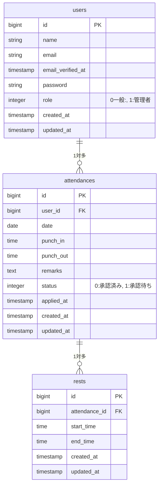

# attendance-system

## 環境構築

**Docker ビルド**

1. `git clone git@github.com:Haruna613/Attendance-system.git`
2. DockerDesktop アプリを立ち上げる
3. プロジェクトルートで `docker-compose up -d --build`

> [!TIP] > **Apple Silicon (M1/M2/M3) 搭載 Mac をご利用の方へ** > `mysql` のビルドでエラーが発生する場合は、`docker-compose.yml` の `mysql` セクションに `platform: linux/amd64` を追記してください。

```bash
mysql:
   platform: linux/amd64
   image: mysql:8.0.26
   environment:
      MYSQL_ROOT_PASSWORD: root
      MYSQL_DATABASE: laravel_db
      MYSQL_USER: laravel_user
      MYSQL_PASSWORD: laravel_pass
```

**Laravel 環境構築**

1. コンテナ内に入る
   ```bash
   docker-compose exec php bash
   ```
2. 依存パッケージのインストール
   `composer install`
3. 「.env.example」ファイルを 「.env」ファイルに命名を変更。または、新しく.env ファイルを作成
4. .env に以下の環境変数を追加

```text
DB_CONNECTION=mysql
DB_HOST=mysql
DB_PORT=3306
DB_DATABASE=laravel_db
DB_USERNAME=laravel_user
DB_PASSWORD=laravel_pass
```

> [!IMPORTANT] > **作業ディレクトリに関する注意**
> 本プロジェクトのソースコードは `src` ディレクトリ配下にあります。
> Docker コンテナ内での操作や `php artisan` コマンドは、プロジェクトルートに移動してから実行してください。

5. APP_KEY の生成

```bash
php artisan key:generate
```

6. マイグレーションの実行

```bash
php artisan migrate
```

7. シーディングの実行

```bash
php artisan db:seed
```

## 使用技術(実行環境)

- PHP8.4.12
- Laravel8.75
- MySQL8.0.26

## ER 図



## URL

- 開発環境：http://localhost/
- phpMyAdmin:：http://localhost:8080/

## メール確認環境（MailHog）

本プロジェクトでは、メール送信テスト用に MailHog を導入しています。
会員登録時のメール認証などの確認が可能です。

- **MailHog UI**: [http://localhost:8027/]

## テストの実行

Feature テストおよび Unit テストを実装しています。
以下のコマンドで全テストを実行し、品質を担保しています。

```bash
docker-compose exec php php artisan test
```
