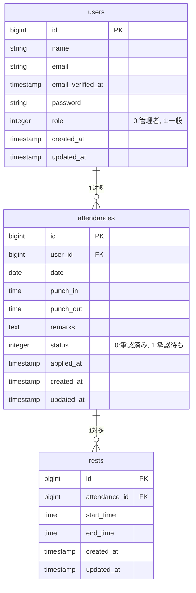

```mermaid
erDiagram
    users ||--o{ attendances : "1対多"
    attendances ||--o{ rests : "1対多"

    users {
        bigint id PK
        string name
        string email
        timestamp email_verified_at
        string password
        integer role "0:管理者, 1:一般"
        timestamp created_at
        timestamp updated_at
    }

    attendances {
        bigint id PK
        bigint user_id FK
        date date
        time punch_in
        time punch_out
        text remarks
        integer status "0:承認済み, 1:承認待ち"
        timestamp applied_at
        timestamp created_at
        timestamp updated_at
    }

    rests {
        bigint id PK
        bigint attendance_id FK
        time start_time
        time end_time
        timestamp created_at
        timestamp updated_at
    }
```
